<div align="center">

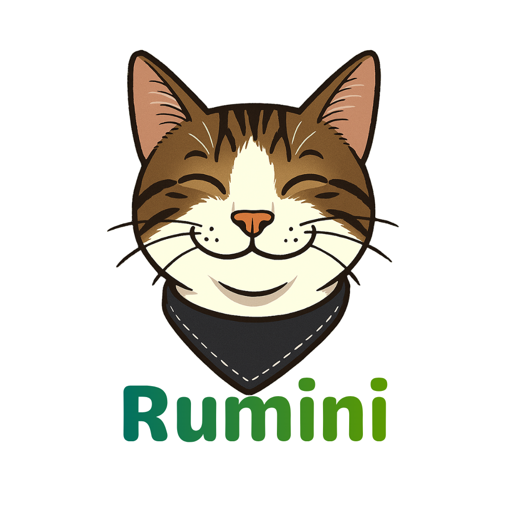

# 💚 Rumini

**AI-Powered Guidance Counseling & Mood Tracking Platform**

*A Web-based Counseling Management System with Android-based Mood Tracking, originally developed for students of Pamantasan ng Lungsod ng Valenzuela (PLV)*


</div>

---

## 📖 The Story

### Where it started

Rumini began as a capstone project addressing a real, documented gap: **Philippine schools are severely under-resourced for student mental health support.** At PLV specifically, only 3-5 guidance counselors serve the entire student population — a ratio far below what's needed — while the guidance office relied on Facebook Messenger and Google Forms for day-to-day operations, with no centralized way to track trends or respond early.

The original capstone — *Rumini: A Web-based Counseling Management with an Android-based Mood Tracking for Students of Pamantasan ng Lungsod ng Valenzuela* — set out to fix that. Built with **Flutter** (Android + Web) and **Firebase/Firestore**, it delivered mood and emotion tracking, automated appointment scheduling, psychoeducational resources, counselor dashboards, and a **rule-based chatbot** for student support — all in one platform, evaluated against ISO/IEC 25010 software quality standards by 100 students, 2 guidance counselors, 1 administrator, and 3 IT experts, earning an overall weighted score of **3.77 / 4.00 ("Strongly Agree")**.

It worked — but the evaluation also pointed at exactly where it strained. **"Editing chatbot responses" and "chatbot response management" scored the lowest of any admin feature (3.00/4.00)**, flagged explicitly as an area needing improvement. The rule-based chatbot's rigid keyword-matching model meant every response had to be manually authored, and when two keywords tied in relevance, the bot would show the student **two competing responses and make them pick one** — functional, but not the natural, supportive conversation a student in distress actually needs.

### Where it's going

This repository picks up from there: **replacing the rule-based chatbot with an NLP-driven conversational assistant**, without discarding the work already put into it.

Instead of throwing away the admin's carefully authored keyword → response → follow-up content, it's **migrated directly into a retrieval-grounded knowledge base** — the same content now grounds a real language model's responses instead of triggering rigid exact matches. The result:

- Natural conversation in **English, Tagalog, and Taglish**, mirrored per message — not just canned replies.
- **No more forced two-response ties** — the bot now blends relevant context into one coherent answer.
- A **crisis-safety layer** that intercepts self-harm/distress signals *before* they ever reach the model, so a generative assistant never has to improvise in a moment that matters.
- **Soft, non-pressuring guidance** toward booking a real counselor — respecting that PLV's counselors are a scarce resource, and that students shouldn't feel funneled or nagged.
- A lightweight **human handoff**: when a counselor steps into a conversation, the AI automatically steps back until released.

The goal wasn't to build something flashier — it was to fix the exact weak point the original evaluation surfaced, while keeping everything else that already worked.

---

## ✨ Key Features

### 👤 Student
- Log daily mood and emotions (up to 4x/day) with a visual calendar
- Chat with **Rumini Bot** — an NLP guidance companion that understands English, Tagalog, and Taglish
- Request appointments with a preferred counselor, track status, and give feedback
- Browse psychoeducational resources (infographics), with tag-based recommendations
- Consent-based control over mood-tracker monitoring visibility
- Fill out forms issued by the guidance office

### 🧑‍⚕️ Counselor
- View and directly chat with assigned students, with a clear AI vs. human sender indicator
- Take over a conversation from the AI at any time — the bot automatically pauses
- Manage appointments (accept, reject, reschedule, mark completed) via calendar
- View mood/emotion analytics for assigned students
- Publish and manage psychoeducational resources

### 🛠️ Admin
- Full visibility across all students, counselors, and appointments
- Manage the chatbot's knowledge base (FAQs, resources, crisis keywords) — the same authoring workflow as before, now powering retrieval instead of exact-match rules
- Manage forms, analytics, and reporting
- Batch student management via CSV upload

---

## 📸 Screenshots

### 📱 Mobile

<p align="center">
  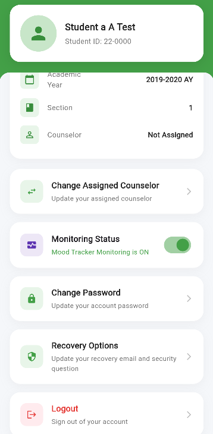
  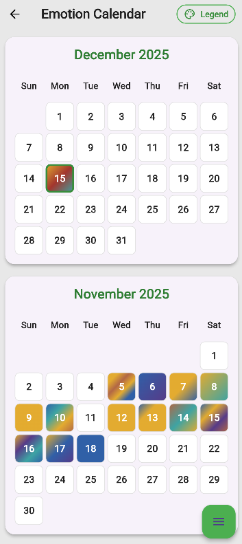
  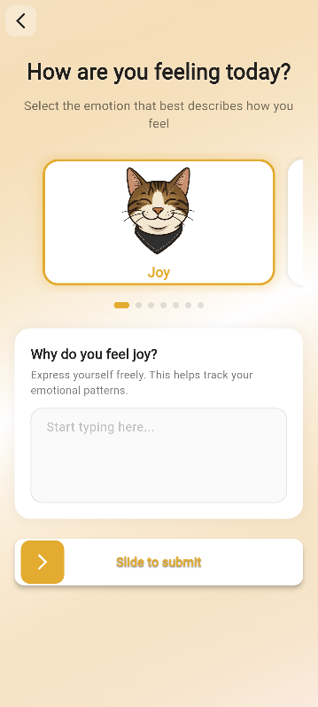
</p>

<p align="center">
  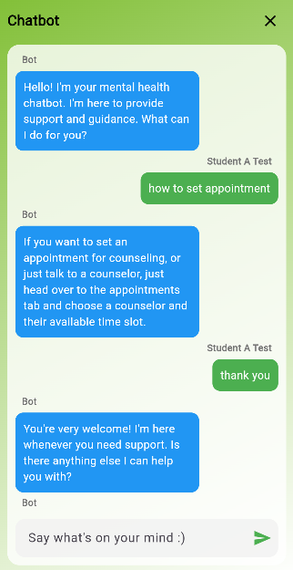
  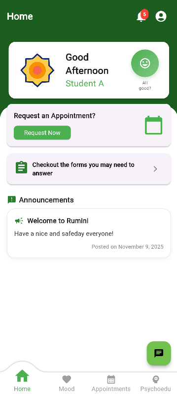
</p>

### 🖥️ Web

<p align="center">
  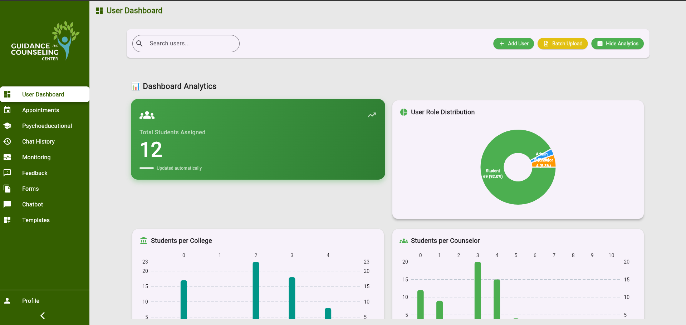
  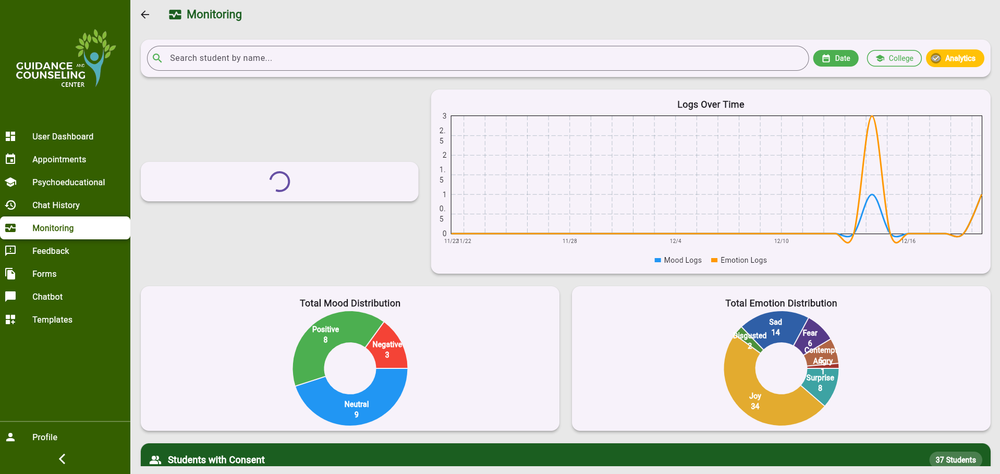
</p>

<p align="center">
  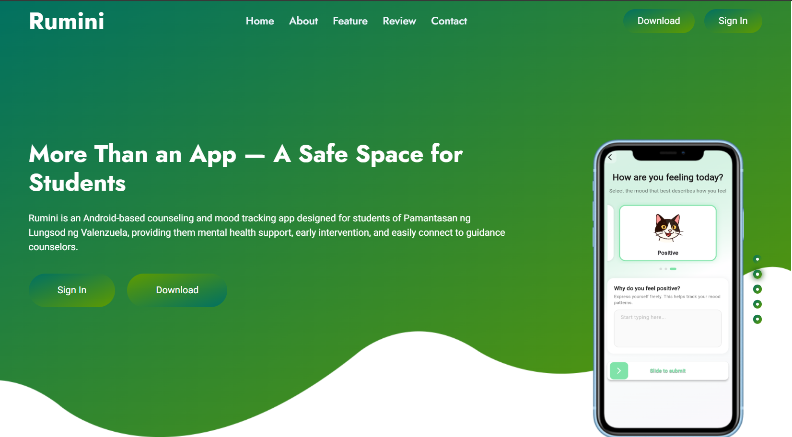
  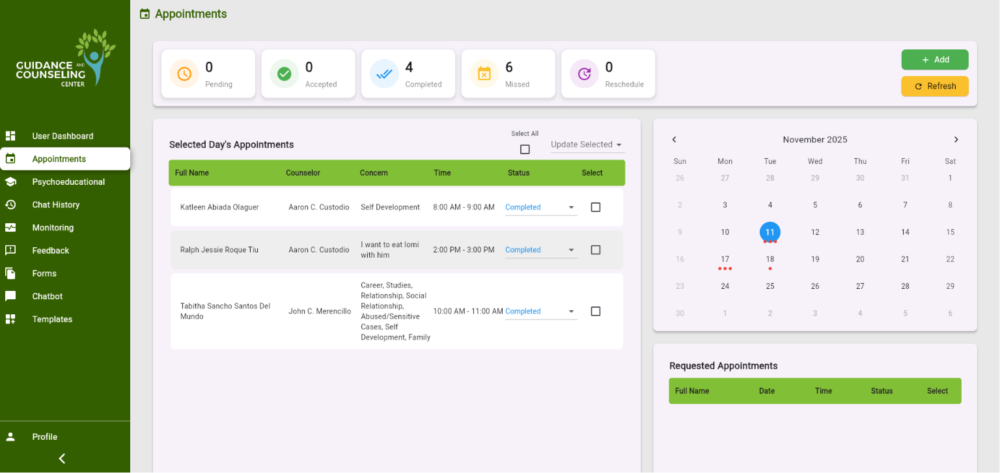
</p>

<p align="center">
  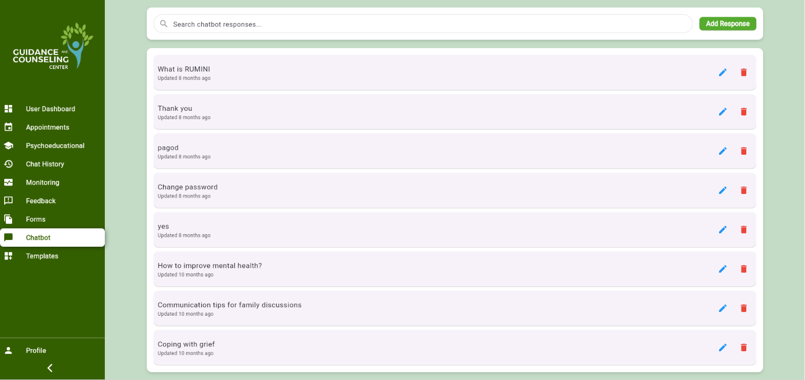
  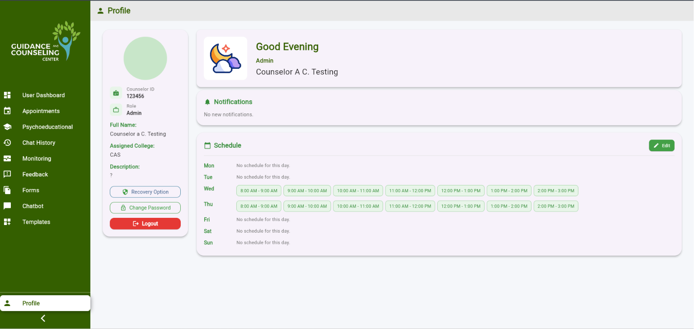
</p>

<p align="center">
  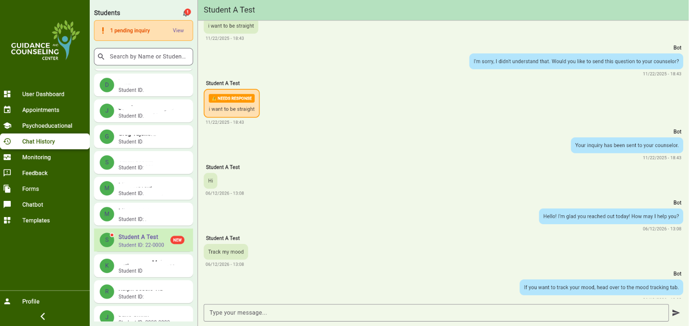
  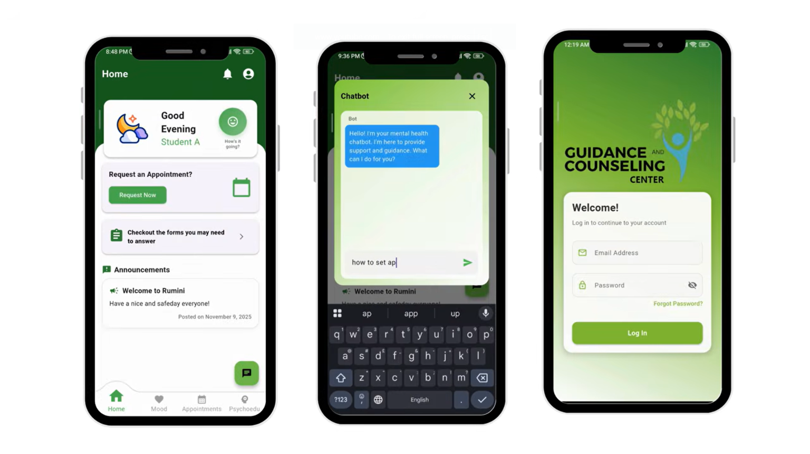
</p>

---

## 🤖 How the Chatbot Works

```
Student message
      │
      ▼
Is a counselor actively handling this conversation? ──► Yes: AI stays paused
      │ No
      ▼
Local crisis-keyword check ──► Match: fixed safety response + hotline info,
      │                          model is never called, event logged
      │ No match
      ▼
Keyword lookup against the admin-curated knowledge base (Firestore)
      │
      ▼
Prompt assembled: persona + matched content + recent history + message
      │
      ▼
NLP model generates a grounded, structured reply (JSON: text + follow-ups)
      │
      ▼
Response shown to student, saved to Firestore
```

**Model:** [Groq](https://groq.com) running `openai/gpt-oss-120b`
**Grounding:** Lightweight keyword-based retrieval over an admin-managed Firestore knowledge base — deliberately simple over full vector/embedding search, matched to the scale of a curated, school-specific FAQ set
**Safety:** Deterministic, on-device crisis-keyword pre-check that bypasses the model entirely when triggered — the model is never the sole handler of a self-harm or crisis disclosure

---

## 🧱 Tech Stack

| Layer | Technology |
|---|---|
| App framework | Flutter (Android + Web) |
| Backend / Database | Firebase, Cloud Firestore |
| AI / NLP | Groq API (`openai/gpt-oss-120b`) |
| Methodology | Agile (iterative sprints: Planning → Design → Development → Testing → Deployment → Maintenance) |

---

## 📊 Evaluation (Original Capstone)

Assessed against ISO/IEC 25010 software quality standards by student users, guidance counselors, and IT experts:

| Characteristic | Weighted Mean | Interpretation |
|---|---|---|
| Compatibility | 3.89 | Strongly Agree |
| Safety | 3.83 | Strongly Agree |
| Functional Stability | 3.80 | Strongly Agree |
| Interaction Capability | 3.80 | Strongly Agree |
| Maintainability | 3.78 | Strongly Agree |
| Security | 3.77 | Strongly Agree |
| Performance Efficiency | 3.71 | Strongly Agree |
| Reliability | 3.67 | Strongly Agree |
| Flexibility | 3.64 | Strongly Agree |
| **Overall** | **3.77** | **Strongly Agree** |

Module-level satisfaction: Student module 3.84, Guidance Counselor module 3.82, Administrator module 3.75.

---

## 🏆 Recognition

Represented the IT department at the **CEIT Research Colloquium**, competing against 8 other teams from the Computer Engineering, Electrical Engineering, and Information Technology departments — earned **3rd Place, Best Presentation**.

<p align="center">
  
</p>

<p align="center">
  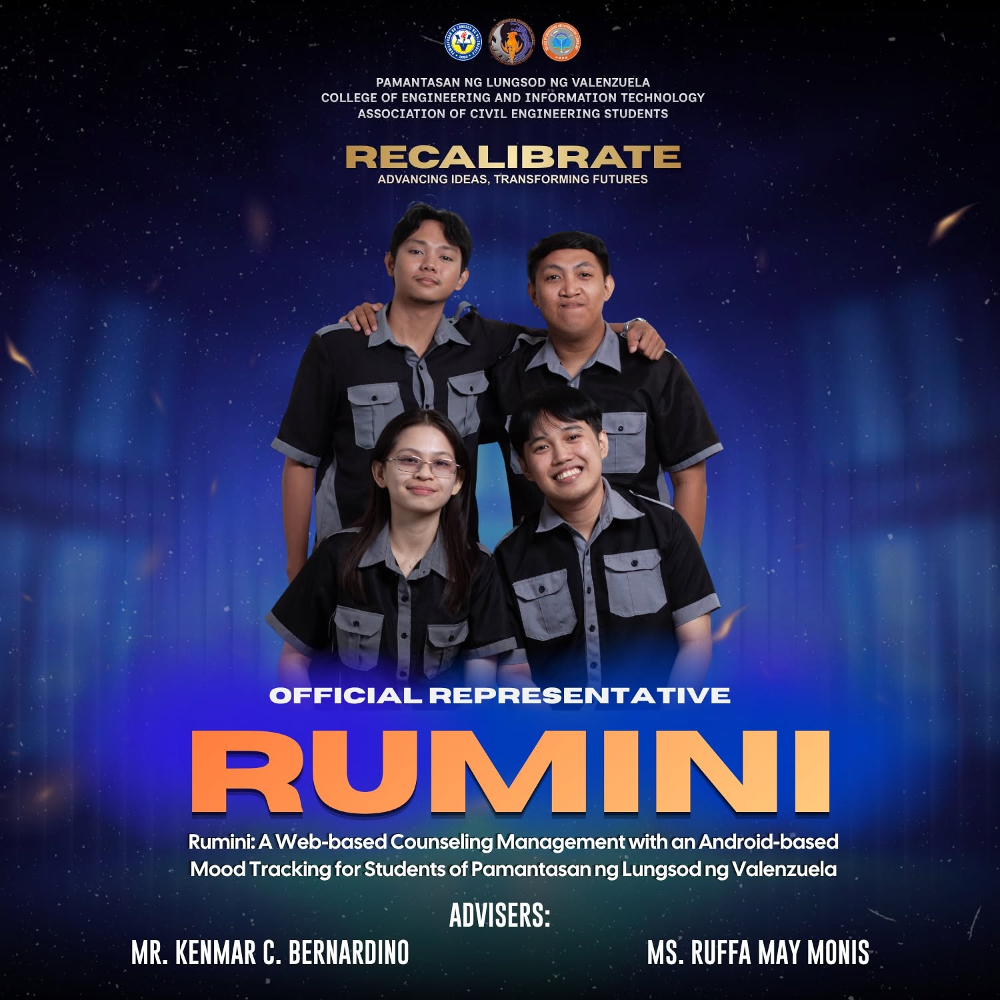
</p>

<p align="center">
  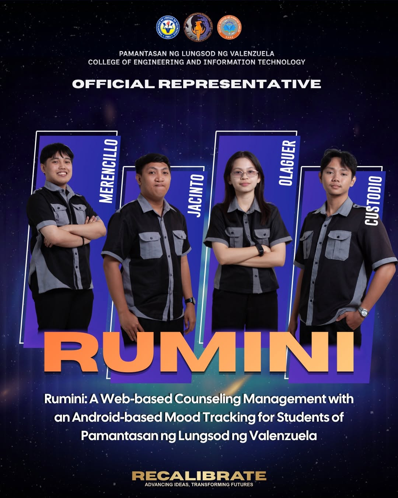
  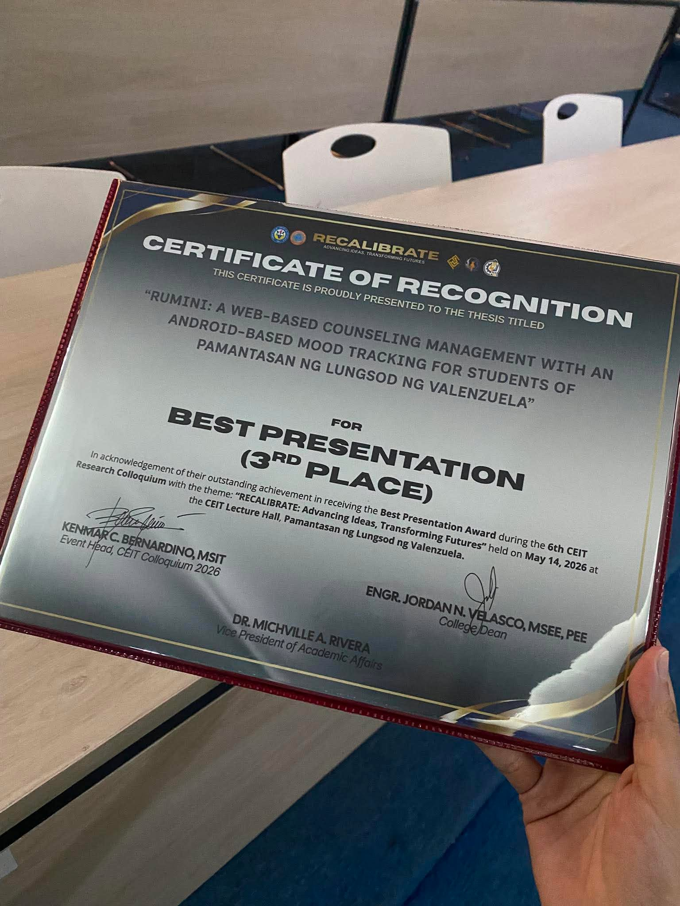
  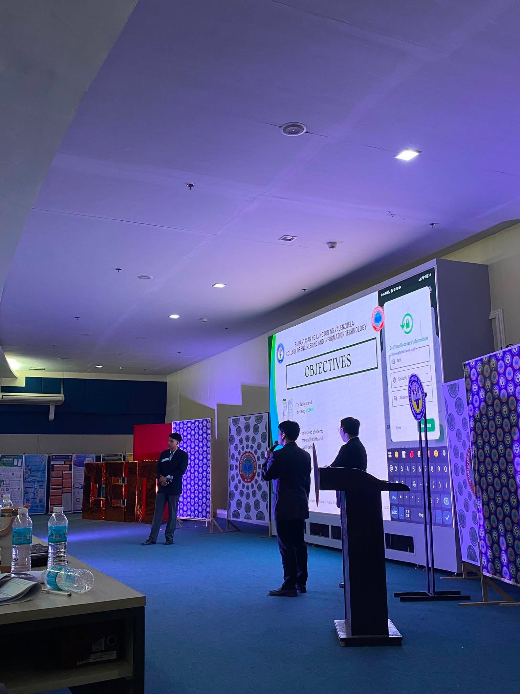
</p>

---

## 🚀 Getting Started

> ⚠️ Fill in the specifics for your environment — this is a general outline.

### Prerequisites
- Flutter SDK
- A Firebase project (Firestore enabled)
- A [Groq API key](https://console.groq.com)

### Setup

```bash
# Clone the repo
git clone <your-repo-url>
cd rumini

# Install dependencies
flutter pub get

# Configure Firebase
# Add your google-services.json (Android) and firebase_options.dart (via flutterfire configure)

# Set your Groq API key (do NOT commit this)
# e.g. via --dart-define or a .env file added to .gitignore
```

### Run

```bash
flutter run              # Android
flutter run -d chrome    # Web
```

---

## 🔒 Safety & Privacy Notes

- Conversations are monitored by the guidance office to help keep students safe and prevent misuse, and are protected under the Data Privacy Act.
- The mood tracker has a separate, student-controlled consent toggle for monitoring visibility.
- Crisis-related messages are intercepted before reaching the AI model and are handled by a fixed, guidance-office-approved response with emergency contact information.
- This chatbot is **not** a substitute for professional mental health care — it exists to listen, support, and connect students to real guidance counselors.

---

## 🗺️ Roadmap

Carried over from the original evaluation's recommended improvements, plus new items from the NLP migration:
- [ ] Optimize batch student upload (CSV)
- [ ] Improve form customization options
- [ ] Upgrade knowledge base retrieval from keyword matching to semantic/embedding-based search, if coverage needs grow
- [ ] Expand crisis-keyword coverage with guidance office review
- [ ] Continued reliability and flexibility improvements per ISO 25010 feedback

---

## 👥 Team

Originally developed as a capstone project by the Department of Information Technology, Pamantasan ng Lungsod ng Valenzuela:

- Aaron Manuel C. Custodio
- Rafael S. Jacinto
- John Carl A. Merencillo
- Katleen Jade A. Olaguer

**Advisers:** Ms. Ruffa May C. Monis (IT), Mr. Kenmar C. Bernardino (MSIT)

---

## 📄 License

<!-- Add your chosen license here, e.g. MIT, Apache 2.0 -->

## 🙏 Acknowledgments

- PLV Guidance Counseling Office, for their collaboration and feedback throughout development
- Built in response to the Mental Health Act (RA 11036) and the Basic Education Mental Health and Well-Being Promotion Act (RA 12080)